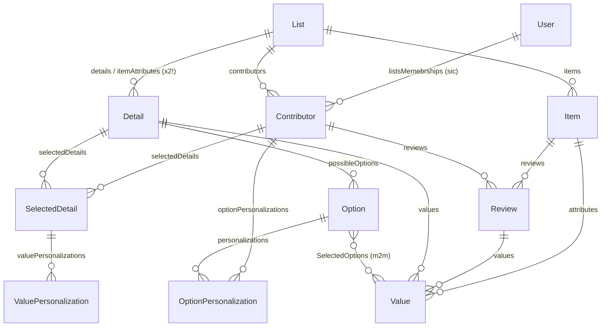

# Analysis of the legacy Amplify schema (`docs/old/schema.graphql`)

This is the GraphQL schema of the old Amplify/AppSync/DynamoDB "goods" app that goods4 is rewriting.
It describes a collaborative reviewing system: users join **Lists** as **Contributors**, lists contain
**Items**, contributors write **Reviews** consisting of **Values** against configurable **Details**
(questions/attributes), with per-user customization layers (**SelectedDetail**, **OptionPersonalization**,
**ValuePersonalization**).

## Domain model overview

| Model | Purpose |
|---|---|
| `User` | Account; only `username`. Membership in lists goes through `Contributor`. |
| `Contributor` | Join entity between `User` and `List`, with a role (`OWNER`/`ADMIN`/`MEMBER`/`APPLICANT`) and saved filters. |
| `List` | A collection (products / places / items) with contributors, items, and details. |
| `Item` | A thing being reviewed; carries denormalized `displayedAttribute1..6` plus item-level `attributes: [Value]`. |
| `Review` | A contributor's review of an item: a `ReviewLabel` plus a set of `Value`s. |
| `Detail` | A configurable question/attribute definition (type, number range, options). Belongs to a list. |
| `SelectedDetail` | Per-contributor customization of a `Detail` (position, privacy, label display). |
| `Option` | A choice for `singleSelect`/`tags` details. |
| `Value` | An answer: number/text/date and/or selected options; belongs to a `Review` *or* an `Item`, and to a `Detail`. |
| `OptionPersonalization` | Per-contributor tweak of an option (sentiment, disabled, position). |
| `ValuePersonalization` | Per-contributor override of a value (sentiment, number/text/date). |

---

## Critical problems

### 1. Everything is publicly readable and writable
The global `AMPLIFY { globalAuthRule ... allow: public }` rule (self-labeled "FOR TESTING ONLY!")
**and** an explicit `@auth(rules: [{allow: public}])` on every single model mean anyone holding the
API key can read, create, update, and delete any record — other users' reviews, lists, even `User`
rows. The `ContributorType` role hierarchy (`OWNER` can delete, `MEMBER` can review, `APPLICANT`
waits for approval) exists **only as documentation**; nothing in the API enforces it, so an
`APPLICANT` — or a non-member — can mutate anything. There is also no link between `User` and a
Cognito identity, so ownership can't even be expressed.

### 2. Two `@hasMany [Detail]` relations from `List`, but only one `@belongsTo` on `Detail`
`List.details` and `List.itemAttributes` both point at `Detail`, while `Detail` has a single
`list: List @belongsTo`. Amplify's transformer generates a separate implicit foreign key for each
`@hasMany` (`listDetailsId`, `listItemAttributesId`), but one `@belongsTo` can only pair with one of
them. The result is ambiguous at best: a `Detail` created through one relation will not appear in
the other, and `detail.list` may be null even when the detail is reachable via `list.itemAttributes`.
The schema's own comment ("does it have to be @HasMany? maybe just an array?") shows this was never
resolved. It should have been a single relation plus a flag/ordering field (e.g. `isItemAttribute`),
or a join model.

### 3. `ValuePersonalization` cannot identify the value it personalizes
It only has `selectedDetail: SelectedDetail @belongsTo`. A `SelectedDetail` is per-(contributor,
detail) — it says nothing about which **item** or which **`Value`** is being overridden. As modeled,
a contributor can store exactly one floating override per detail with no way to attach it to a
specific item's value, which contradicts the type's name and apparent purpose. It needs a relation
to `Value` (or to `Item` + `Detail`).

### 4. `singleSelect` cardinality is unenforceable
Option selection is modeled as a many-to-many (`Value` ↔ `Option` via `SelectedOptions`) shared by
all detail types. Nothing prevents a `Value` for a `singleSelect` detail from linking to five
options, or from linking to options that belong to a *different* detail than `value.detail`.

## Data-integrity pitfalls

### 5. Every `@belongsTo` is nullable — orphans everywhere
- `Contributor.user` and `Contributor.list` are optional, but a contributor is meaningless without both.
- `Review.item` / `Review.contributor` optional → anonymous or item-less reviews are valid writes.
- `Value` has **three** optional parents (`review`, `item`, `detail`): a value should belong to
  exactly one of review/item and always to a detail, but "zero parents" and "all three parents"
  are equally accepted. GraphQL can't express XOR, and nothing else enforces it.

### 6. No uniqueness constraints on the join/personalization entities
DynamoDB + Amplify enforce none of the natural composite keys, so duplicates are possible for all of:
- `Contributor` per `(user, list)` — a user can join the same list twice with different roles.
- `SelectedDetail` per `(contributor, detail)`.
- `OptionPersonalization` per `(contributor, option)`.
- `Review` per `(contributor, item)` — if one-review-per-item was intended, it isn't enforced.
- `Value` per `(review, detail)` — a review can answer the same question twice.

### 7. "Immutable" `Detail` contains a mutable required counter
The comment says `Detail` is immutable, yet `usageCount: Int!` is a counter that must change.
Being non-null with no default, every client must supply it on create; being a plain field on
AppSync/DynamoDB, increments are read-modify-write and race under concurrency (lost updates).
Combined with public auth, anyone can set it to anything.

### 8. `createdByContributorID: ID` is a bare ID, not a relation
No `@belongsTo`/`@index`: no referential integrity, no efficient "details created by X" query, and
deleting the contributor leaves a dangling ID.

### 9. No cascade deletes
Amplify does not cascade. Deleting a `List` strands its `Contributor`s, `Item`s, `Detail`s; deleting
a `Value` or `Option` leaks rows in the hidden `SelectedOptions` join table. The client would have
to hand-delete entire subtrees, which public auth makes possible but nothing makes atomic.

### 10. Denormalized `displayedAttribute1..6` with no sync story
Six positional string slots duplicated from `attributes` values. Nothing updates them when the
underlying value changes, the fixed count of 6 is arbitrary, and the comments are copy-paste
mistakes (`# year` four times). Positional fields also make reordering attributes a data migration.

### 11. `Item.attributes: [Value]` reuses the review-value type for canonical data
The comment says these "must not vary from user to user", but `Value` is the same row type used for
per-review answers — so an item attribute can accidentally also carry a `review` parent, and
review-value queries must filter item-values out (and vice versa).

## Bugs & naming errors

### 12. Typo baked into the API: `listsMemebrships`
`User.listsMemebrships` (should be `listsMemberships`) propagates into generated queries, mutation
inputs, TypeScript types, and the implicit FK/GSI names — painful to fix once data exists. Comment
typos too: "Key fileds".

### 13. Enum style inconsistency
`DetailType` uses camelCase (`singleSelect`, `number`, `text`...) while every other enum is
SCREAMING_SNAKE. Beyond style, lower-case enum values like `number` collide with reserved/primitive
names in some codegen targets.

### 14. Redundant/conflicting range configuration on `Detail`
`numberRange: FIVE | HUNDRED | CUSTOM` **and** `minValue/maxValue/step` are two overlapping sources
of truth. What wins when `numberRange = FIVE` but `maxValue = 10`? Also `defaultPrivate` and
`private # used as Default values in SelectedDetail` look like two fields for the same purpose.

### 15. Unresolved ordering question
`Detail.position` is commented out and `SelectedDetail.position` is required — so ordering only
exists per-contributor. A list has no default detail order for new/non-customizing members, and
every new member must generate `SelectedDetail` rows just to see an ordered form.

## Minor smells

- `username: String!` has no uniqueness guarantee (DynamoDB can't enforce it outside the PK).
- `savedFilters: AWSJSON` — unvalidated blob; fine as a pragmatic choice, but schemaless.
- `Option.label` and `Option.position` are nullable — label-less options render as what?
- `ListType.ITEMS` vs `PRODUCTS` is ambiguous (everything in a list is an `Item`).
- Dead commented-out `Club` type and `customOptions` questions left in the shipped schema.

---

## Migration notes for goods4 (Postgres/Supabase)

Things the relational rewrite should fix by construction:

1. **Real constraints**: `NOT NULL` FKs with `ON DELETE CASCADE`; composite `UNIQUE` on
   `(user_id, list_id)`, `(contributor_id, detail_id)`, `(contributor_id, option_id)`, and — if
   intended — `(contributor_id, item_id)` for reviews and `(review_id, detail_id)` for values.
2. **Value parentage**: `CHECK ((review_id IS NULL) <> (item_id IS NULL))` (exactly one parent),
   `detail_id NOT NULL`; consider separate `review_values` / `item_attribute_values` tables instead
   of one overloaded table. Enforce option↔detail consistency and singleSelect cardinality with
   constraints or triggers.
3. **Collapse `details`/`itemAttributes`** into one relation plus a boolean (or a position column
   on `Detail` for default ordering) — resolves problems 2 and 15 at once.
4. **Replace `displayedAttribute1..6`** with a query/view over values, or a jsonb column maintained
   by trigger if denormalization is still wanted.
5. **RLS instead of `allow: public`**: policies keyed on the contributor role per list
   (`OWNER`/`ADMIN`/`MEMBER`/`APPLICANT`), tied to `auth.uid()`.
6. **Fix names now**: `lists_memberships`, snake_case columns, consistent enum casing
   (Postgres enums or check-constrained text).
7. **`usageCount`** → either drop it (derivable via `COUNT`) or maintain it with an atomic
   `UPDATE ... SET usage_count = usage_count + 1` / trigger.
8. **`created_by_contributor_id`** as a real FK with `ON DELETE SET NULL`.
9. **Data migration caveat**: because of the double-relation bug (problem 2), exported DynamoDB
   `Detail` items may carry either `listDetailsId` or `listItemAttributesId` (or both) — map both
   columns when importing.
